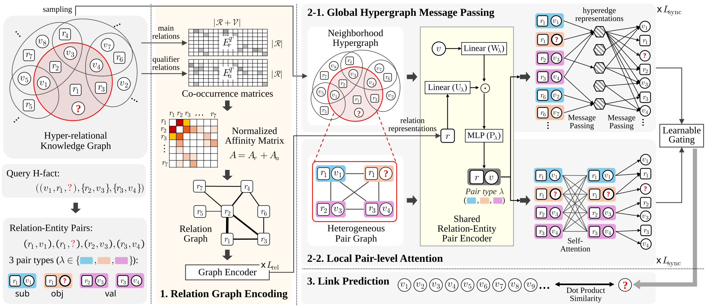

# [2026][KDD][GLoRE]
This is the [PyTorch](https://pytorch.org/) implementation of **GLoRE**, **G**lobal-**Lo**cal representations via **R**elation-**E**ntity pair encoding. \[[Link](https://example.com/paper.pdf)\]

## Publication

- **Title**: **Joint Global-Local Representations via Relation-Entity Pair Encoding for Hyper-Relational Knowledge Graphs.**
- **Authors**: Sangjun Ji, Sangjune Kim, Bonyou Koo, Youngho Lee, Xiongnan Jin, and Byungkook Oh.
- **Venue**: ACM SIGKDD Conference on Knowledge Discovery and Data Mining 2026

## Overview
<p align="center">
  
</p>

## Requirements
We used **Python 3.11** and **PyTorch 2.5.1** with **CUDA Toolkit 11.8**.  
All experiments were conducted on a single 48G NVIDIA RTX 6000 Ada.

The implementation also depends on `torch-geometric`, `numpy`, `scipy`, `python-igraph`, and `tqdm`.

## How to Run

### Step 1. Download raw data
We consider three representative n-ary relational datasets, and the datasets can be downloaded from:
- [JF17K](https://www.dropbox.com/sh/ryxohj363ujqhvq/AAAoGzAElmNnhXrWEj16UiUga?dl=0)
- [WikiPeople-](https://github.com/gsp2014/WikiPeople)
- [WD50K](https://zenodo.org/record/4036498#.Yx06qoi-uNz)

### Step 2. Preprocess data
Then we convert the raw data into the required format for training and evaluation. The new data is organized into a directory named `data`, with a sub-directory for each dataset. In general, a sub-directory contains:
- `train.json`: train set
- `valid.json`: dev set
- `train+valid.json`: train set + dev set
- `test.json`: test set
- `all.json`: combination of train/dev/test sets, used only for *filtered* evaluation
- `vocab.txt`: vocabulary consisting of entities, relations, and special tokens like [MASK] and [PAD]

> Note: JF17K is the only one that provides no dev set.

### Step 3. Training & Evaluation

To train and evaluate GLoRE, please run:

```
python -u ./src/run.py --dataset [DATASET] --device [GPU_ID] --vocab_size [VOCAB_SIZE] --vocab_file [VOCAB_FILE] \
                       --train_file [TRAIN_FILE] --test_file [TEST_FILE] --ground_truth_file [GROUND_TRUTH_FILE] \
                       --num_workers [NUM_WORKERS] --num_relations [NUM_RELATIONS] \
                       --max_seq_len [MAX_SEQ_LEN] --max_arity [MAX_ARITY]
```

The script automatically creates directories for checkpoints and results. Set the parameters according to the statistics of each dataset.

- `DATASET` is the dataset name used for logging, result files, checkpoints, and cached preprocessing files.
- `GPU_ID` is the GPU ID to use. Multiple GPU IDs can be provided as a single string, e.g., `0123`.
- `VOCAB_SIZE` is the vocabulary size of the dataset.
- `VOCAB_FILE`, `TRAIN_FILE`, `TEST_FILE`, and `GROUND_TRUTH_FILE` are the paths to `vocab.txt`, `train.json` or `train+valid.json`, `test.json`, and `all.json`, respectively.
- `NUM_WORKERS` is the number of workers when reading the data. 
- `NUM_RELATIONS` is the number of relations in the dataset.
- `MAX_ARITY` is the maximum arity of n-ary facts in the dataset, and `MAX_SEQ_LEN` is the maximum length of n-ary sequences, which is equal to `2 * MAX_ARITY - 1`.

Please modify those hyperparameters according to your needs and the characteristics of different datasets.


For JF17K, to train and evaluate on this dataset using default hyperparameters, please run:

```
python -u ./src/run.py --dataset "jf17k" --device "0" --vocab_size 29148 --vocab_file "./data/jf17k/vocab.txt" --train_file "./data/jf17k/train.json" --test_file "./data/jf17k/test.json" --ground_truth_file "./data/jf17k/all.json" --num_workers 1 --num_relations 501 --max_seq_len 11 --max_arity 6 --hidden_dim 256 --sync_layers 3 --global_activation elu --fusion_layers 1 --trans_layers 6 --local_dropout 0.2 --local_heads 4 --decoder_activation "gelu" --batch_size 1024 --lr 5e-4 --weight_decay 0.002 --entity_soft 0.9 --relation_soft 0.9 --epoch 400 --warmup_proportion 0.05 --rel_layers 2 --max_per_type 40 --max_neighbors_num 70 --global_dropout 0.1
```

For WikiPeople-, to train and evaluate on this dataset using default hyperparameters, please run:

```
python -u ./src/run.py --dataset "wikipeople" --device "0" --vocab_size 35005 --vocab_file "./data/wikipeople/vocab.txt" --train_file "./data/wikipeople/train+valid.json" --test_file "./data/wikipeople/test.json" --ground_truth_file "./data/wikipeople/all.json" --num_workers 1 --num_relations 178 --max_seq_len 13 --max_arity 7 --hidden_dim 256 --sync_layers 4 --global_activation elu --fusion_layers 1 --trans_layers 6 --local_dropout 0.1 --local_heads 4 --decoder_activation "gelu" --batch_size 1024 --lr 5e-4 --weight_decay 0.01 --entity_soft 0.2 --relation_soft 0.1 --epoch 100 --warmup_proportion 0.1 --rel_layers 2 --max_per_type 25 --max_neighbors_num 25 --global_dropout 0.4
```

For WD50K, to train and evaluate on this dataset using default hyperparameters, please run:

```
python -u ./src/run.py --dataset "wd50k" --device "0" --vocab_size 47688 --vocab_file "./data/wd50k/vocab.txt" --train_file "./data/wd50k/train+valid.json" --test_file "./data/wd50k/test.json" --ground_truth_file "./data/wd50k/all.json" --num_workers 1 --num_relations 531 --max_seq_len 19 --max_arity 10 --hidden_dim 256 --sync_layers 5 --global_activation elu --fusion_layers 1 --trans_layers 6 --local_dropout 0.1 --local_heads 4 --decoder_activation "gelu" --batch_size 1024 --lr 5e-4 --weight_decay 0.01 --entity_soft 0.2 --relation_soft 0.1 --epoch 150 --warmup_proportion 0.1 --rel_layers 2 --max_per_type 40 --max_neighbors_num 40 --global_dropout 0.4
```

## Hyperparameter Tuning & Reproducibility

Please tune the hyperparameters of our model because the best hyperparameters may be different due to randomness and dataset characteristics.
We recommend:

- Adjust `hidden_dim`, `sync_layers`, `trans_layers`, `local_heads`, `dropout`, `lr`, `batch_size`, `weight_decay`, `epoch`, `warmup_proportion`.
- For large graphs, consider reducing `max_neighbors_num` / `max_per_type` to manage memory.

All results (including ablations) are evaluated using the same fixed test neighbor cache, built from the training split only, with ONR disabled during evaluation.

For further questions, please contact: [sangjunji02@gmail.com](mailto:sangjunji02@gmail.com).
